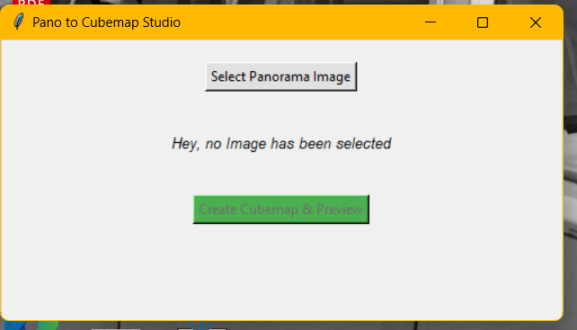
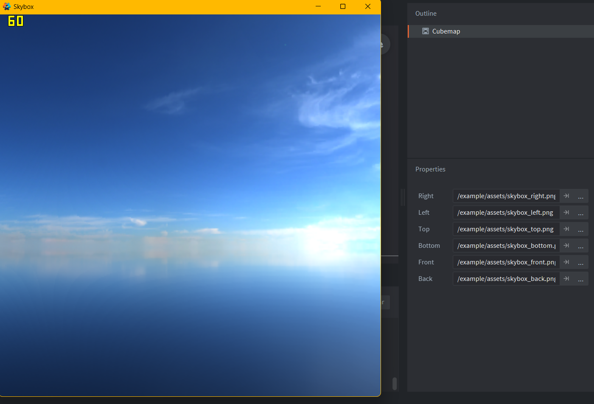

+++
title = "Cube mappy, Another reinvention of the wheel"
description = ""
date = "2026-06-17"
author = "Miracle"
+++

As you may know, I have a knack for reinventing things that already exist. Most of the time, though, it's for learning purposes.

One example is Cube Mappy, a project I started to sharpen my Python skills, and improve my Defold experience.

At its core, Cube Mappy is a simple tool that converts 360° panoramic images into six separate images, each representing one face of a cubemap, exactly what Defold likes.

*Simple stuff we have here*
https://github.com/miraclegx/cubeMappy/releases/tag/version-1.0

## Miracle why make it?

There are a few reasons.

First, the learning experience. I kinda really enjoy understanding how things work under the hood it can get really stupid sometimes :).

Second, I have a general dislike(hate) for web-based tools. Some of my reasons are quite reasonable, like for a long time i spent most parts of my life on an old weak pc, the real defintion of a potato, the specs of which I am not vulnurable enough to share.Some probably aren't. Either way, I don't like the idea of everything living in a browser. I prefer having tools that run locally on my machine.

Finally, automation. I enjoy writing my own tools. I like knowing how things work, and I like having complete control over my workflow. It's one of the reasons I enjoy using Defold, though that's a discussion for another day.

*Workin sky box*

## Biggest motivation

When working with engines like Godot and you want to add a skybox, you can usually provide an HDR panoramic image directly. The engine handles all the necessary transformations behind the scenes.

I don't know much about all the projection and image-mapping theory involved, but the engine takes care of it for you.

Defold, being Defold, doesn't do that automatically.

Instead, you have to provide the cubemap faces yourself.

That gave me the perfect excuse to build Cube Mappy :).

You give it a panoramic image, and it outputs six images in the format Defold expects.

## Brick wallz

The conversion algorithm turned out to be more complex than I initially expected. Learning and implementing it completely on my own would have taken a while, so I got some help from Google on steroids, in simpler terms AI. I dont know what your thoughts on AI for development are but, I am not actually a fan of vibe coding, though that statement may seem self contradictory forgive me future Miracle lol 🥲 .

The good news is that it works.

The bad news is that it's still not where I want it to be.

For example, Cube Mappy currently can't process HDR files directly. You first have to convert them to PNG before feeding them into the tool.

Direct HDR support is definitely something I want to add in the future.

## Hey Aren't There Already Tools For This?

Absolutely.

There are online tools that can do the same thing.

But why use them when I can have my own version?

Mine works offline.

It doesn't require an internet connection.

And most importantly, I learned something by building it.

**Yup dats dats for now, bye.**