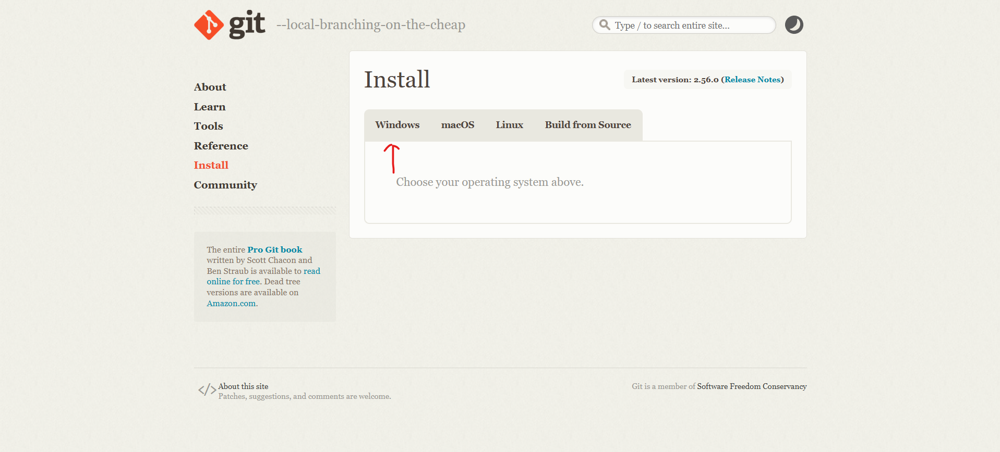
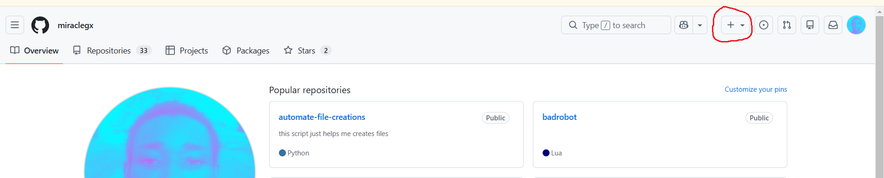
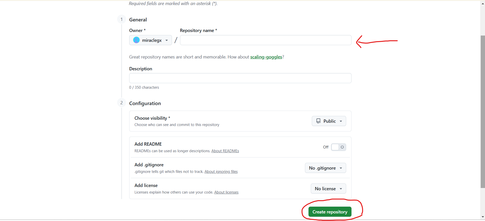
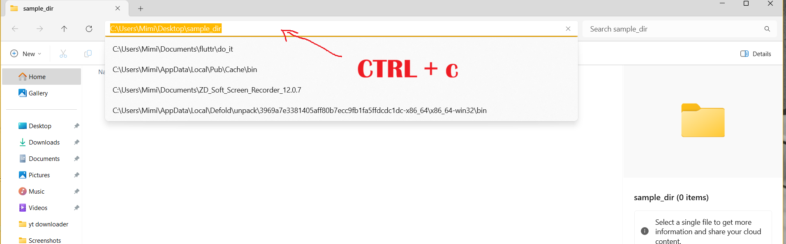
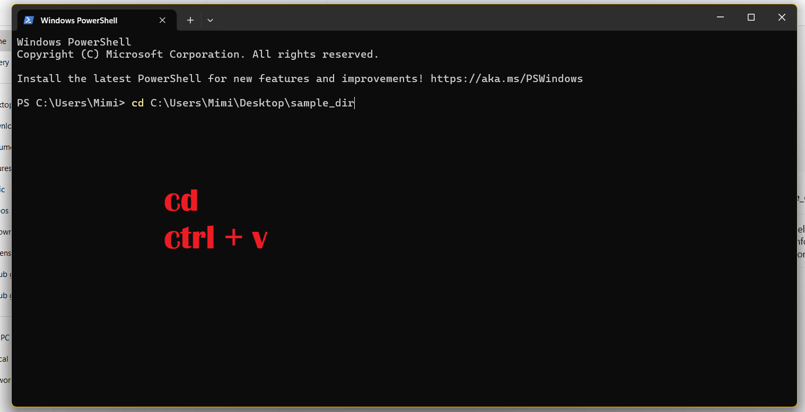
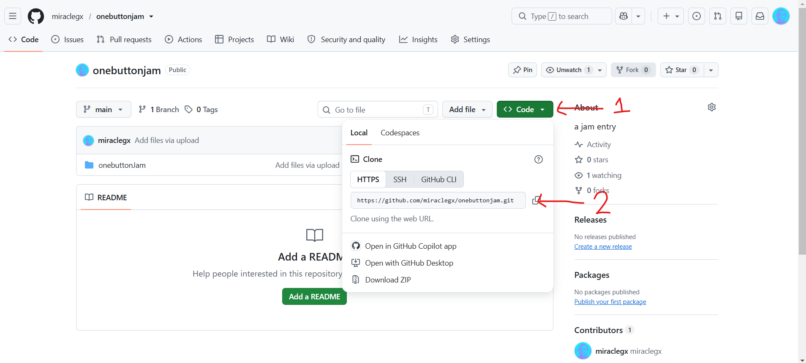

This guide covers the steps required to start pushing your code to Github.

---

## Step 1: Download and Install Git

Before running any Git commands, you will need Git installed on your computer.

### Windows
1. Download the installer from [git-scm.com](https://git-scm.com/downloads).

2. Run the `.exe` file and accept the default settings during setup.
3. Open **Command Prompt** or **Git Bash** to verify the installation:

```bash
git --version
```

### Linux (Ubuntu/Debian)
Simply open your terminal: **Ctrl+alt+t**
```bash
sudo apt update
sudo apt install git
```

### Step 2: Configure your Git identity
1. Still in your terminal or cmd and run the commands below, replace "your name" and "your.email@example.com" with your actual name and email respectively
```bash
git config --global user.name "Your Name"
git config --global user.email "your.email@example.com"
```

### Step 3: Create a new Github repo
1. Log in to Github
2. Click the + icon in the top right corner and select **New repository**.

3. Fill in your repository details
4. Click Create **repository**.


### Step 4: Initialize Git in Your Project Folder
Navigate to your local project directory in your terminal and initialize a Git repository:
```bash
cd path/to/your/project
git init
```



### Step 5: Stage and Commit Your Code
Add your project files to the staging area and create your first commit snapshot:
```bash
# Add all files in the current directory to staging
git add .

# Commit staged changes with a descriptive message
git commit -m "Initial commit"
```

### Step 6: Link Local Repo and Push to GitHub
1. Set your default branch name to main if its not "main" already:
```bash
git branch -M main
```
2. Then go to Github and copy the remote repository link



3. Link your local project to your remote GitHub repository:
```bash
git remote add origin link_you_copied
```
3. Push your code to GitHub:
```bash
git push -u origin main
```

Hooray you are done, now refresh your page
> Finally for subsequent commits just use "git push"