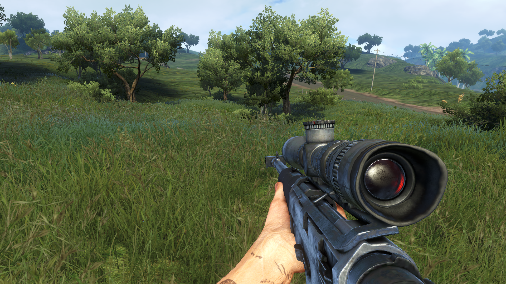

+++
title = "Grassy Dreams"
description = "Tryin so render grass in Defold"
date = "2026-07-24"
#aliases = ["about-us", "about-hugo", "contact"]
author = "Miracle"
+++

So, for a while now, I've been really interested in grass. :)

note all puns are intended

Like, I even wonder what cows must think when they see some green, juicy grassland. They'd probably be like, "Woah, woah, Tabby, come check this out!" And Tabby would be like, "Come on, bet you've never been to the Meadow of Pinks."

Yeah, so for a while now I've been playing Far Cry 3. This is kinda my first time though, and I really took an interest in the visuals....especially the grass. It really caught my eye... or eyes, maybe. Something about the lush fullness of it all.

So my brain was like:

> "Uhm wont it be cool if we made an fps game? One that takes place in a grassy field."

So yeah... new quest it was.

Funny thing was, I knew almost nothing about 3D rendering, or even about making a game in the third dimension. And to top it off, I was using Defold. Yup. Not Godot, not GDevelop. Defold. Meaning no hand-holding, so I might actually spend more time in tears than seeing rendered grass.[Notice how dont usually reference Unity, well I dont like it]

Did I actually Spend more time in tears? Yep

After scouring and pouring over dozens of materials (really dozens... you can't even name one lol), I finally saw some grass on my screen. Hurray, right?[insert those screenshots]

Nah, my joy was short-lived because what I had made was an inefficient soup.

Then, after I finally managed to render the grass in somewhat respectable numbers, I got to see how the real men do it. And to be honest, I'm quite happy with my first attempt (really first attempt? The project is literally called *Yet Another Grass*), because it showed me where I could've done better and let me get my feet wet too.

So first of all, how do we start?

Ummmm...

Okay, we should probably first learn how to render a single blade of grass.
Rendering a model in defold is not really dat hard, infact its quite straigt forward.
	1. You import ya model
	2. You create a game object and add the model component
	3. You select a suitable material
	4. You select a texture if you need
	5. Add a camera
	6. Hopefully you see your model
[miracle why do you make defold look so hard?]
[show a screenshot of ya first grass model]

So dat being done, lets render em plenty. But wait how are we gonna do dat, uninformed mike may just duplicate the grass game object, which is quite okay for ten or maybe some hundreds if your cpu is nice.[it will be cool if u actuall try dis out and screen shot it and show em how bad it will be]. This might work but it is really ineffiectient, cos for each grass  the cpu will have to make a draw call to the gpu. Imagine dis 

Cpu be like "hey gpu
Draw grass
Draw grass
Draw grass
Draw grass
……..four thousand times later
Draw grass
"
Doin it dis way will heavily choke the poor cpu, while the overly capable gpu will be chilling between draw calls, dis is called a cpu bottleneck.

Would not it be cool if the cpu could just tell the gpu to draw as many models  in a single draw call? Asked the perfomance hungry graphics programmers to the hardware engineers? Probably some cool nerds[insert nerd picture no offense].  Dats where gpu instacing comes in(also one of those words I use to impress the boys :)).
[insert cool screenshots of insancing]

Normally or pretty lamely, when you want to draw something to the screen, like a sprite or a Cacodemon model, for example, you make a draw call.

Thatis the CPU tells the GPU:

"Draw this quad, texture it with a specified image, and place it at x,y on the screen.
Now imagine we have 1,000 sprites. The cpu will have to do the above 1000 times, along side, physics calculations, audio playback, input management and whatever.

Now think about grass. We usually have thousands of blades on screen at once. *(Insert cool screenshot.)*

So in a wrap using gpu instacing the cpu can just sent the appropriate data to the gpu to be drawn x number of times.

Asked the performance-hungry graphics programmers.

Probably some cool nerds.

Then, somehow, they got their wish, and boom, they could do exactly that.

There is a caveat, though. Every instance has to share the exact same mesh and material.

But for grass, that's more than enough.

So, armed with the magical words "GPU instancing," I started my quest to render a grassy field.

Since I was using a fairly unfamiliar engine, I first had to learn how to render a single model. Just one. That's where I started.

But Defold, being Defold, gave me a lot of friction at first. A lot.

Materials, shaders, textures... though, to be fair, part of that was on me because I took the opportunity to learn a bit about 3D rendering and shaders too.

Now, Defold, being a good engine by the way, automatically handles GPU instancing, though a few requirements have to be met. *(Insert said requirements here, Miracle.)*

At a high level, all you really need is to use a mesh-instanced material, which, to be frank, doesn't look all that different from the normal model material.

So yeah, after some dilly-dallying around with an example, I finally got a single grass model rendered.

Then I basically spawned them in a grid.

Yep.

That's it.

Bye.

Now, maybe my approach was correct, and it worked, but my FPS wasn't exactly encouraging.

While I do have a low-end GPU, I also have expectations for it because I know what it can do.

So getting a measly 80 FPS while rendering only grass was heartbreaking.

I was only rendering around 4,000 grass models, and I was getting 80 FPS.

Like, bro...

This is barely even a lawn.

So after a while, I looked into the cause, and... yeah.

It was the way I was animating the grass.

Every single frame, I looped through all 4,000 grass objects, sending animation data to each one.

Pretty bad way to do things.
